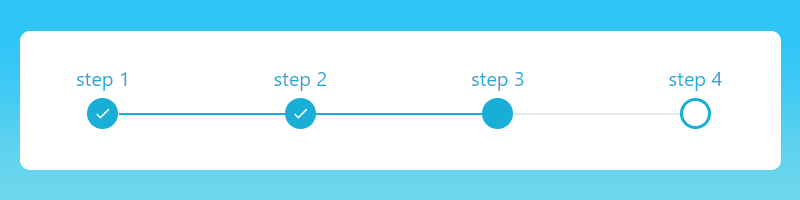

# react-stepper-js

> Stepper component for react

[](https://www.npmjs.com/package/react-stepper-js) [](https://standardjs.com)

## Install

```bash
npm install --save react-stepper-js
```

## Usage

```jsx
import React, { Component } from 'react'

import Steeper from 'react-stepper-js'
import 'react-stepper-js/dist/index.css'

class Example extends Component {
  render() {
    return <Steeper
      color="#23b561"
      fontSize="20px"
      steps={[
        { label: "step 1" },
        { label: "step 2" },
        { label: "step 3" },
        { label: "step 4" }
      ]}
      currentStep={4}
    />
  }
}
```

## License

MIT © [Ori Deri] (https://github.com/Orid19)
